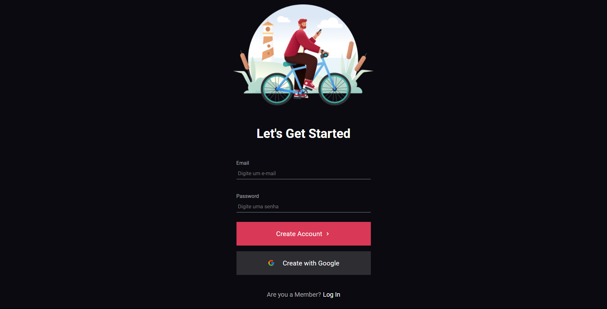

<h1>Login System</h1>
 

> Home Page
>  
> 

 

> Register Page
>  
> 

 

> <h3>Descrição do projeto</h3>

 

O projeto 'Sistema de Login' é uma aplicação web desenvolvida utilizando HTML, CSS e JavaScript. Seu principal propósito é emular o processo de registro e login de usuários na aplicação. Este projeto inclui um sistema de validação de campos e fornece notificações em caso de erros ou êxito durante o processo de cadastro ou login..

---
  

 <h2>Programadores:</h2>

  

<table>
  <tr>
      <td align="center">
          <a href="#">
                 
                
                <b>Isaque Batista</b>
                
         </a>
      </td>
  </tr>
</table>
